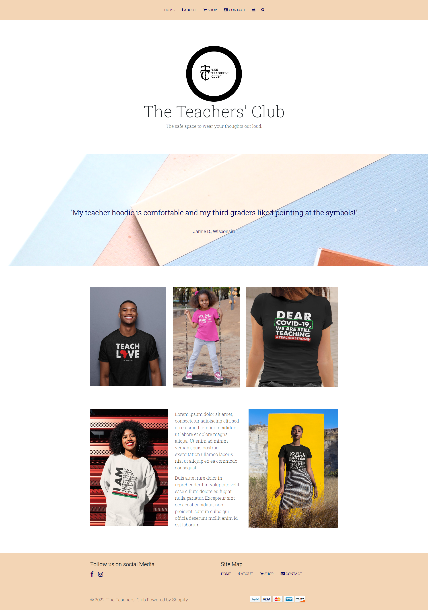

# THE TEACHERS' CLUB React App

## Reimagined www.teachersclubaccess.com website in react code. 

### Bootstrap Project 

I developed this project during my bootstrap course. This project contained various components and styling of SASS and bootstrap. This project will incorporate the following from the bootstrap project:

- Carousels
- Navbar
- Footer
- Links
- Responsive Design

I am developing this project to have a different style from the bootstrap project, so that when this application is converted to code for mobile development, it will appear appeasing and be accessible to all users.

